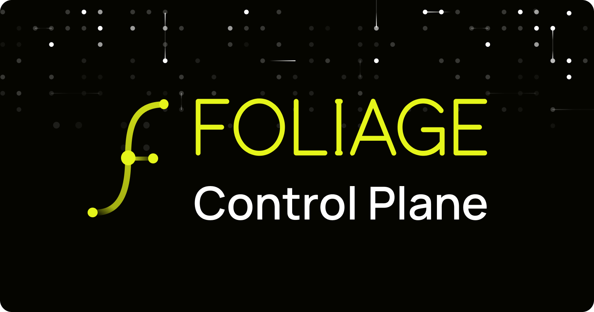
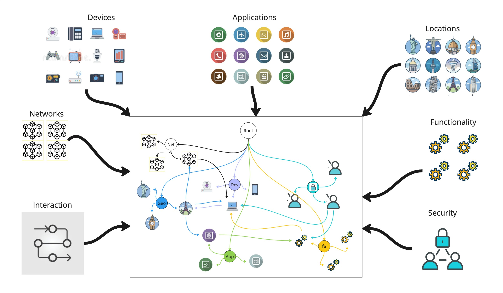
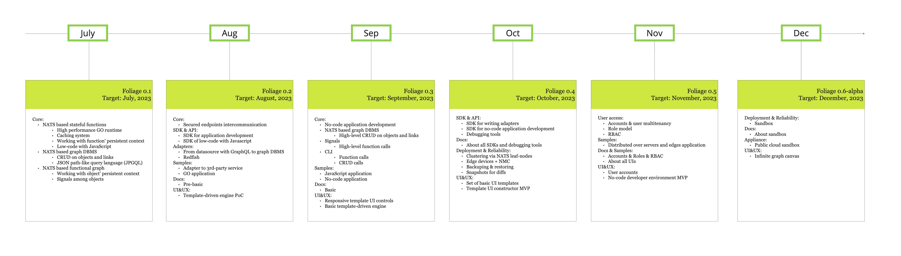

# Foliage SDK

<p align="center">
  
</p>

[Foliage](https://www.foliage.dev/): where frustration sparks innovation.

[![License][License-Image]][License-Url] ![Lint][Lint-Status-Image-Url]

[License-Url]: https://www.apache.org/licenses/LICENSE-2.0
[License-Image]: https://img.shields.io/badge/License-Apache2-blue.svg
[Lint-Status-Image-Url]: https://github.com/foliagecp/sdk/actions/workflows/golangci-lint.yml/badge.svg

[](https://github.com/dhomak/sdk/blob/main/README.md) [](https://github.com/dhomak/sdk/blob/main/README-RU.md)


## Table of Contents

- [Introduction](#introduction) <!--omit from toc--> 
- [Core Concepts](#core-concepts)
  - [Abstract](#abstract)
  - [Features](#features)
- [Getting Started](#getting-started)
  - [Minimum Requirements](#minimum-requirements)
  - [Installation](#installation)
  - [Health Status Check](#health-status-check)
  - [Running Tests](#running-tests)
- [Development](#development)
  - [Working with the SDK](#working-with-the-sdk)
- [Technology Stack](#technology-stack)
- [Roadmap](#roadmap)
- [References](#references)
- [License](#license)
- [Contributing](#contributing)

## Introduction 

**Foliage** is an open-source, collaborative platform powered by a distributed graph database. It offers a flexible and high-performance foundation for edge computing, automation, and cross-domain integration. Ideal for IoT, process orchestration, and real-time logic execution.
## Core Concepts

### Abstract

Foliage reimagines complex systems by bringing their structure and logic into a shared, abstracted graph space. This enables clearer visibility and deeper understanding—blurring the line between model and implementation.



#### System Architecture Overview

The system is conceptually divided into two main layers:

- **Data Layer** — a graph and object model describing the structure and relationships between elements.
- **Logic Layer** — a functional layer implementing the system’s behavior.

---

#### Functional Layer

The functional layer is built on **serverless stateful functions**, each encapsulating the behavior of a specific type of object or a group of related objects represented in the object model. These functions can be viewed as **logic projections onto individual graph nodes**.

Each function:

- Maintains its own **state**, storing information about previous interaction steps with a specific object.
- Holds a **separate state for each object** it interacts with.
- Is responsible for executing a **clearly defined fragment of business logic**.

---

#### Function Interaction

During execution, a function may:

- **Send calls (signals)** to other functions associated with neighboring objects in the graph.
- **Wait for their responses** before continuing its own logic.

A key feature is the **non-blocking execution model**:

- When sending signals, the function **completes the current execution iteration**, saving context information in its state.
- Upon reactivation (e.g., triggered by signals from previously called functions), it **resumes execution** with the received results.
- This design **avoids blocking** the function while waiting for responses and allows it to be **reused in other tasks**.

---

#### Principle of Mass Asynchronous Interaction

This behavior model reflects processes typical in real-world systems (such as large organizations), where:

- Numerous **agents (functions)** simultaneously tackle different subtasks.
- They **exchange information and coordinate**, but are **not rigidly dependent** on the completion of all interactions before starting new ones.
- The result is **scalable, parallel, and asynchronous** operation without mutual blocking.

This ensures the system is **resilient to delays** and can **efficiently handle tasks** that are complex in depth and distributed in logic.

### Features


Foliage takes the complexity out of system design by **bringing different knowledge domains into one unified graph**. This makes it easier to understand relationships, spot hidden dependencies, and keep your architecture consistent and transparent. It’s like giving your system a shared brain—smart, connected, and easy to work with.

---

### Graph Database & Functional Graph

At the core of Foliage is a powerful **graph structure** where:

- **Nodes (vertices)** store your data.
- **Edges** connect everything—and they can store data too!
- **Functions** get triggered by signals at these nodes and can reach out to neighboring nodes through their edges.

---

### Data + Metadata = One Unified Graph

No more silos. In Foliage, everything—objects, links, types, functions, and apps—lives in a **single shared graph**. That means you can link and traverse between data and metadata effortlessly. Signals can travel through this structure based on type relationships, making things incredibly dynamic.

---

### Distributed Event Bus

Foliage uses a **highly asynchronous event system** where signals are broadcast as events across a cluster-based message bus. It’s fast, persistent, and guarantees **“exactly once”** delivery—no duplicates, no lost messages.

---

### Distributed Async Runtime

Your app runs on a **network of async functions**, each tailored to handle a specific object. Define your business logic as a sequence of function calls and let Foliage distribute them wherever they’re needed—across data centers or devices.

---

### Serverless & Stateful Functions

Every function is **serverless**, distributed, and comes with its **own persistent memory**. That means functions remember their past interactions with specific objects, without needing a central server to coordinate.

---

### Reliable, Persistent Storage

Function states are stored **asynchronously and durably** in the system’s core cluster. So even if a service crashes or gets relocated, everything picks up right where it left off.

---

### Graphs That Think and Communicate

In Foliage, graphs aren’t just for storage—they’re **living networks**. They serve as **pathways for signals** to travel from one object to another. Signals can follow simple or complex routes depending on edge types and attributes.

---

### Edge-Ready and Controller-Friendly

Deploy Foliage functions **directly on edge devices**—like BMCs, PLCs, or RPis. Functions are routed smartly to wherever they need to run.

---

### Built for Performance

Foliage can handle up to **400,000 function calls per second** on mid-range hardware. Thanks to clusterization, performance scales almost linearly with your infrastructure.

---

### Graph Traversal Made Easy

Navigate your graph like a pro with **an XPath-style query language**. Use it to explore, discover, and define how signals should move through your system.

---

### Plug-and-Play Applications

Foliage apps are designed to **work together**. They all tap into the same graph, share data models, and reuse logic—so building on existing functionality is a breeze.

---

### No-Code & Low-Code Friendly

Whether you're scripting or configuring, Foliage makes it easy to define functions and full applications using **scripts or visual tools**. You can build complete workflows without writing much code—or any at all.

---

### Graph-Based UI Builder

Use the graph as your **data source for interactive UIs**. Foliage offers a templated, tunable toolkit for building web interfaces that reflect the actual structure of your system.

---

### Weighted Graphs for AI and ML

Want to do signal processing or build ML workflows? Foliage supports **weighted edges**, letting you build neural-style networks inside the graph. It works with **scalars, vectors, and tensors**—perfect for advanced MLOps.


## Getting Started

### Minimum Requirements

**Native Installation**

Foliage’s native setup follows the same system requirements as [NATS Jetstream](https://docs.nats.io/running-a-nats-service/introduction/installation#with-jetstream).

**Docker Installation**

To run Foliage in a containerized environment, all you need is [Docker](https://docs.docker.com/desktop/install/linux-install/).

---

### Installation

Clone the repository to get started:

```bash
git clone https://github.com/foliagecp/sdk.git
```

Full setup details are available in the [documentation](https://pkg.go.dev/github.com/foliagecp/sdk).

---

### Health Status Check

1. **Check that NATS server and Foliage runtime are running fine**:
```sh
% docker ps

CONTAINER ID   IMAGE                      COMMAND                  CREATED          STATUS          PORTS                                                                    NAMES
...
b5a2deb84082   foliage-sdk-tests:latest   "/usr/bin/tests basic"   11 minutes ago   Up 11 minutes                                                                            tests-runtime-1
fac8d1bfef3a   nats:latest                "/nats-server -js -s…"   11 minutes ago   Up 11 minutes   0.0.0.0:4222->4222/tcp, 0.0.0.0:6222->6222/tcp, 0.0.0.0:8222->8222/tcp   tests-nats-1
``` 

2. **Check that NATS server is running fine**:
```sh
% docker logs tests-nats-1

...
[1] 2023/10/16 09:00:43.094325 [INF] Server is ready
```

3. **Check that Foliage runtime runs without errors**:
```sh
% docker logs tests-runtime-1 | grep "error" -i
```


### Running Tests

Foliage provides a set of test samples to help you get familiar with the platform. Follow these steps to run them:

#### 1. Navigate to `tests`:

```sh
cd tests
```

#### 2. Build the tests runtime:

```sh
docker-compose build
```

#### 3. Customize the test environment in `.env`:
```sh
nano ./basic/.env
```

#### 4. Start the tests:

```sh
docker-compose up -d
```

#### 5. To stop and clean everything up:
```sh
docker-compose down -v
```
Use the `TEST_NAME` environment variable to run other test suites. TK!


## Development

### Working with the SDK

Start building your own apps with Foliage by installing the SDK:

```sh
go get github.com/foliagecp/sdk
```

Helpful guides:

- [Graph CRUD operations](./docs/graph_crud.md)  
- [JPGQL: Foliage's JSON Path Graph Query Language](./docs/jpgql.md)  
- [Visual graph debugger](./docs/graph_debug.md)  
- [How to write a Foliage app](./docs/how_to_write_an_application.md)  
- [Performance measurement](./docs/performance_measures.md)

## Technology Stack

Foliage runs on a modern and efficient tech stack:

### Backend

- NATS Jetstream  
- NATS KV Store  
- NATS WebSocket  
- GoLang  
- JavaScript (V8 Engine)

### Frontend

- React  
- TypeScript/JavaScript  
- WebSocket

### Common

- Docker  
- Docker Compose

[Learn about our technology choices](./docs/technologies_comparison.md)

---

## Roadmap

Check out where we’re headed:  


## References

- [Glossary](./docs/glossary.md)  
- [Code conventions](./docs/conventions.md)  
- [External API](./docs/external_api.md)

## License

Unless otherwise noted, the Foliage source files are distributed under the Apache Version 2.0 license found in the LICENSE file.

## Contributing

We welcome your ideas, improvements, and feedback. Help us grow Foliage into a powerful tool for building intelligent, connected systems. Check the [issues](https://github.com/foliagecp/sdk/issues) and open a PR anytime!
