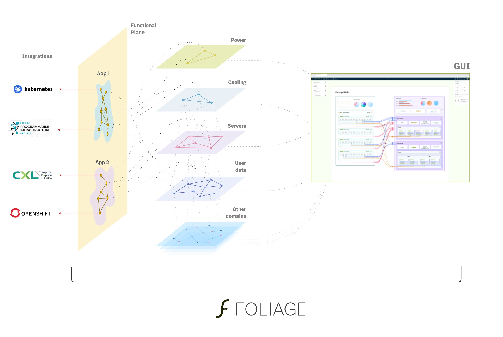

# Foliage SDK

<p align="center">
  
</p>

[Foliage](https://www.foliage.dev/) is a collaborative application platform built upon a distributed graph database, providing a unified and extensible environment for effortless automation, cross-domain connectivity, and high-performance, edge-friendly runtimes.

[![License][License-Image]][License-Url] ![Lint][Lint-Status-Image-Url]

[License-Url]: https://www.apache.org/licenses/LICENSE-2.0
[License-Image]: https://img.shields.io/badge/License-Apache2-blue.svg
[Lint-Status-Image-Url]: https://github.com/foliagecp/sdk/actions/workflows/golangci-lint.yml/badge.svg

## Table of Contents

- [Introduction](#introduction) <!-- omit in toc -->
- [Core Concepts](#core-concepts)
  - [Abstract](#abstract)
  - [Features](#features)
- [Getting Started](#getting-started)
  - [Minimum Requirements](#minimum-requirements)
  - [Installation](#installation)
  - [Health Status Check](#health-status-check)
  - [Running Tests](#running-tests)
  - [Customization](#customization)
- [Development](#development)
  - [Working with the SDK](#working-with-the-sdk)
- [Technology Stack](#technology-stack)
- [Roadmap](#roadmap)
- [References](#references)
- [License](#license)
- [Contribution](#contribution)

## 🚀 Introduction

**Foliage** is an open-source, collaborative platform powered by a distributed graph database. It offers a flexible and high-performance foundation for edge computing, automation, and cross-domain integration. Ideal for IoT, process orchestration, and real-time logic execution.
## 🧠 Core Concepts

### 🧩 Abstract

Foliage reimagines complex systems by bringing their structure and logic into a shared, abstracted graph space. This enables clearer visibility and deeper understanding—blurring the line between model and implementation.


### 🔍 Features

By unifying various knowledge domains into a single shared space, Foliage simplifies relationships, uncovers hidden dependencies, and promotes consistent logic across your architecture.




Click [here](./docs/features.md) to see all features. !TK

## 🛠️ Getting Started

### ✅ Minimum Requirements

**Native Installation**

Foliage’s native setup follows the same system requirements as [NATS Jetstream](https://docs.nats.io/running-a-nats-service/introduction/installation#with-jetstream).

**Docker Installation**

To run Foliage in a containerized environment, all you need is [Docker](https://docs.docker.com/desktop/install/linux-install/).

---

### 📥 Installation

Clone the repository to get started:

```bash
git clone https://github.com/foliagecp/sdk.git
```

📚 Full setup details are available in the [documentation](https://pkg.go.dev/github.com/foliagecp/sdk).

---

### 🩺 Health Check

1. **Check that NATS server and Foliage runtime are running fine**:
```sh
% docker ps

CONTAINER ID   IMAGE                      COMMAND                  CREATED          STATUS          PORTS                                                                    NAMES
...
b5a2deb84082   foliage-sdk-tests:latest   "/usr/bin/tests basic"   11 minutes ago   Up 11 minutes                                                                            tests-runtime-1
fac8d1bfef3a   nats:latest                "/nats-server -js -s…"   11 minutes ago   Up 11 minutes   0.0.0.0:4222->4222/tcp, 0.0.0.0:6222->6222/tcp, 0.0.0.0:8222->8222/tcp   tests-nats-1
``` 

2. **Check that NATS server is running fine**:
```sh
% docker logs tests-nats-1

...
[1] 2023/10/16 09:00:43.094325 [INF] Server is ready
```

3. **Check that Foliage runtime runs without errors**:
```sh
% docker logs tests-runtime-1 | grep "error" -i
```


### 🧪 Running Tests

Foliage provides a set of test samples to help you get familiar with the platform. Follow these steps to run them:

#### 1. Navigate to `tests`:

```sh
cd tests
```

#### 2. Build the tests runtime:

```sh
docker-compose build
```

####3. Customize the test environment in `.env`:
```sh
nano ./basic/.env
```

####4. Start the tests:

```sh
docker-compose up -d
```

####5. To stop and clean everything up:
```sh
docker-compose down -v
```
💡 Use the `TEST_NAME` environment variable to run other test suites. TK!


## 🧑‍💻 Development

### Working with the SDK

Start building your own apps with Foliage by installing the SDK:

```sh
go get github.com/foliagecp/sdk
```

Helpful guides:

- [Graph CRUD operations](./docs/graph_crud.md)  
- [JPGQL: Foliage's JSON Path Graph Query Language](./docs/jpgql.md)  
- [Visual graph debugger](./docs/graph_debug.md)  
- [How to write a Foliage app](./docs/how_to_write_an_application.md)  
- [Performance measurement](./docs/performance_measures.md)

## 🧰 Technology Stack

Foliage runs on a modern and efficient tech stack:

### Backend

- NATS Jetstream  
- NATS KV Store  
- NATS WebSocket  
- GoLang  
- JavaScript (V8 Engine)

### Frontend

- React  
- TypeScript/JavaScript  
- WebSocket

### Common

- Docker  
- Docker Compose

🔍 [Learn about our technology choices](./docs/technologies_comparison.md)

---

## 🗺 Roadmap

Check out where we’re headed:  


## 📎 References

- [Glossary](./docs/glossary.md)  
- [Code conventions](./docs/conventions.md)  
- [External API](./docs/external_api.md)

## 📄 License

Unless otherwise noted, the Foliage source files are distributed under the Apache Version 2.0 license found in the LICENSE file.

## 🤝 Contributing

We welcome your ideas, improvements, and feedback. Help us grow Foliage into a powerful tool for building intelligent, connected systems. Check the [issues](https://github.com/foliagecp/sdk/issues) and open a PR anytime!
